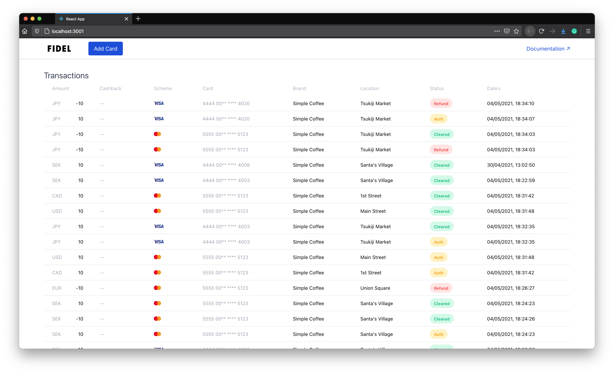

# Sample Application for Building a Card-Linked Application on the Fidel Platform With the Fidel Web SDK

The application in this repository implements:

- a Node.js Server that listens for webhook events coming from Fidel and passes them on to a client via WebSocket.
- a React Client that receives transactions from the server via a WebSocket, and can link cards using the Fidel Web SDK.



If you want to run it locally, please start by cloning the repo to your local environment:

```sh
$ git clone git@github.com:FidelLimited/fidel-card-linking-tutorial.git
```

## Requirements

You'll need a few things before you can run this sample application locally:

- [Node.js](https://nodejs.org/en/) v14.x.
- [ngrok](https://ngrok.com/download) downloaded and installed (it might also ask you to sign up for an account in the process).
- [A Fidel Account](https://dashboard.fidel.uk/sign-up?ref=github-sample).

## Getting Started

### Run ngrok

We are using `ngrok` to expose our locally running application server to the Fidel platform without deploying it in a hosted environment. After you've downloaded and installed `ngrok`, you'll need to run it on port 3000 because the application server is listening on that particular port.

```sh
$ ./ngrok http 3000
```

ngork will give you a random-looking ngrok.io URL, similar to `https://98c1bcdc8042.ngrok.io`. Please make a note of it. You will use it to register webhooks in the [Fidel Dashboard](https://dashboard.fidel.uk/webhooks).

### Register Webhooks

After you've signed up for a Fidel account, you'll notice it comes with demo data in a test sandbox. Your account has a "Demo Program", which we'll use with this sample application. We'll register webhooks on the demo program in the [Fidel Dashboard](https://dashboard.fidel.uk/programs). If you click on the program name on the main screen, you'll see a "Webhooks" option appear on the side menu. Choosing that option will take you to the [Webhooks](https://dashboard.fidel.uk/webhooks) screen, where you can register a "New webhook".

This application server implements a generic catch-all webhook route in `/api/webhooks/:type`. By appending the ngrok URL you got earlier, you can register any of the webhooks supported in the Fidel Dashboard.

We recommend you register at least 2 webhooks, `transaction.auth` and `transaction.clearing`, the sample application client in this repository is using them. The Webhook URLs should be similar to `https://98c1bcdc8042.ngrok.io/api/webhooks/transaction.auth` and `https://98c1bcdc8042.ngrok.io/api/webhooks/transaction.clearing`.

### Run the Application

First, let's install the project dependencies:

```sh
$ npm install
```

Then, we'll need to create an environment file and populate the Fidel SDK Key and the Fidel Demo Program ID.

```sh
$ cp example.env .env
```

Add your Fidel SDK key in the newly created `.env` file. You'll find the key in the [Account page of the Fidel Dashboard](https://dashboard.fidel.uk/account/plan). Please use the Test SDK key. It will start with `pk_test_`. The Program ID can be found in the Fidel Dashboard, on the [Programs page](https://dashboard.fidel.uk/programs). Each program has a side menu available, with a "Copy ID" option in the menu.

That's it, you're ready to run the sample application:

```sh
$ npm start
```

## Use the Application

After you've run the sample application, a browser window will open to http://localhost:3001/. You can add cards, and see transactions appear in real-time in the UI. To create the transactions, you can use the [Playground in the Fidel Dashboard](https://dashboard.fidel.uk/playground).
